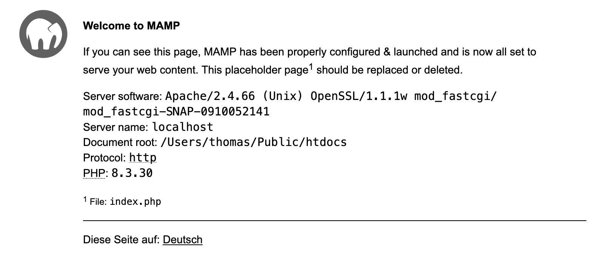

# Local development environment setup

(instructions are provided for macOS, but should be similar for Windows and Linux)

1. Install the Prettier VSCode extension for code formatting, and configure VSCode to format on save. This will ensure that the code is consistently formatted according to the project's style guidelines:

   ```json
   {
     "editor.formatOnSave": true,
     "editor.defaultFormatter": "esbenp.prettier-vscode"
   }
   ```

2. Install [MAMP](https://www.mamp.info/en/) (Apache, MySQL, PHP). They provide a free version that is sufficient for local development. You can also use [XAMPP](https://www.apachefriends.org/index.html) or install the components separately.

3. Launch MAMP. Go to the `MAMP` menu, and open the settings. Navigate to the "Server" tab and set the "Document root" to `~/Public/htdocs` (create this folder if needed). This is to keep the blog files outside of the application folder.

4. Start the servers (Apache and MySQL) from the MAMP control panel. Navigate to `http://localhost:8888` in your browser to verify that the server is running. You should see the MAMP welcome page:

   

5. Create a new MySQL database for Dotclear. You can do this by navigating to `http://localhost:8888/phpMyAdmin5/`.
   1. Create a new database named `dotclear-china` (or any name you prefer).
   2. Note down the database name, username (default is `root`), and password (default is `root`) for later use during the Dotclear installation. Since this is a local development environment, you can use the default credentials, but make sure to change them in a production environment.

6. Download the latest version of [Dotclear](https://dotclear.org/) and extract it into the `~/Public/htdocs` folder. Rename the extracted folder to `blog`.

7. Install Dotclear by navigating to `http://localhost:8888/blog/admin/install/` in your browser. Follow the installation steps, providing the database name, username, and password you created earlier.

   Blog address: http://localhost:8888/blog/index.php

   Administration interface:http://localhost:8888/blog/admin/

8. [Deploy the theme](./deploy-theme.md).

9. Log into the admin interface.

10. [Configure Dotclear](./dotclear-config.md)

11. Check that the blog is working correctly by navigating to `http://localhost:8888/blog/index.php`. You should see the blog with the China theme applied.
