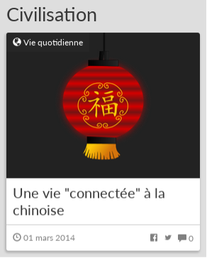
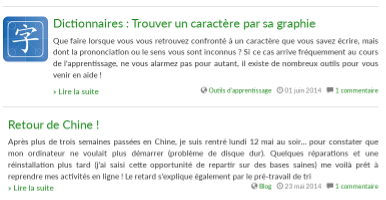

# How to associate images to articles

Such images will appear in two contexts:

* A **large image**, that will be visible on the main page as a thumbnail:
 
  

  **Note:** in case no large image is provided, the picture will be replaced by a generic picture for the given category, defined by the theme.

* A **small image**, visible along the title and description of the article every time it appears in a list of posts (search results, category content, etc.)

  

  **Note:** in case no small image is provided, the picture will be ignored, as shown by the second snippet on the previous example.

To activate this functionality, follow these steps:

1. Install the **MyMeta** Dotclear plugin from http://plugins.dotaddict.org/dc2/details/mymeta or from the Dotclear plugin management page of the admin interface.
2. Go to the **My Meta** configuration page under the **Plugins** section of the Doclear administration interface.
3. Create a new metadata of type **string**, with identifier **ENTRY_IMAGE** and with a prompt similar to "Image associated to the post (180 x 180, relative path from media folder root)"
4. Create a new metadata of type **string**, with identifier **ENTRY_LARGE_IMAGE** and with a prompt similar to "Large image for home page thumbnails (400 x 300, relative path from media folder root)"

In the post creation/edition panel, you should now have two new fields at the bottom. For a given article, write inside the path inside the public media folder where your image is located (for instance, if your image is at http://www.mydomain.com/dotclear/public/folder1/my_image.png, just  write "folder1/my_image.png").
