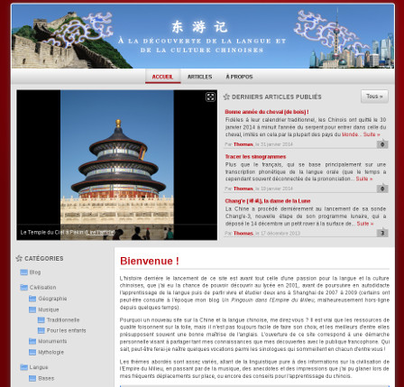
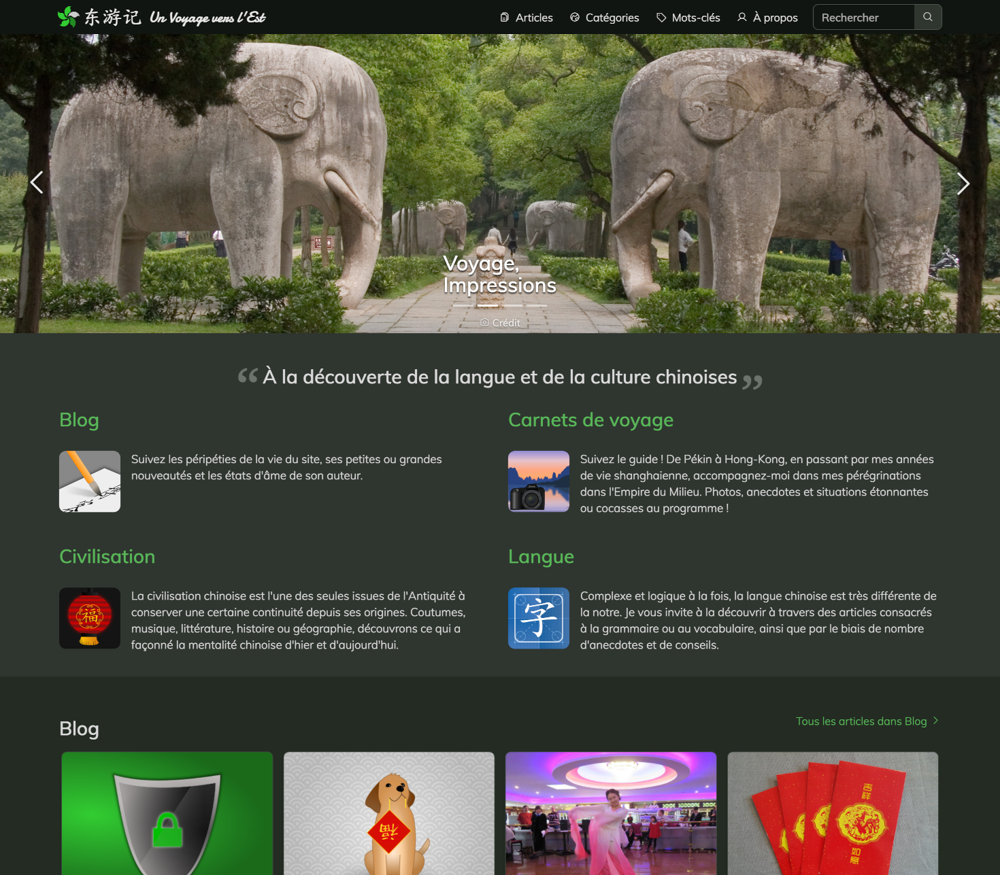

# Theme history

## Version 1 "Happiness Red"

Released on September 10, 2013, along with the blog, this first version of the theme was derived from the [dcChristmas](https://blog.html-edition.com/billet/160) theme, originally written by [Mathieu M.](https://www.html-edition.com/). As its parent, it was available under the terms of the GNU/GPL.

It was tested against Dotclear 2.5 to 2.7.

## Version 2 "Green Orchid"

Released on July 5, 2015, this version of the theme was a complete rewrite based on Bootstrap, still available under the terms of the GNU/GPL, featuring an improved and modernized responsive, mobile-friendly design.

This version was developed and tested with Dotclear ≥ 2.7 until Dotclear 2.29.

## Version 3 "Green Orchid 2"

Extensive rework of version 2, featuring a new font, improved readability and a much-needed dark mode.

Under-the-hood, it comes with significant modernization, in particular:

- Migration from LESS to SCSS
- Migration to Bootstrap 5
- Dropping of the jQuery dependency
- No more download of a KaiTi font
- Use of Phosphor icons instead of Glyphicons
- Better management of the color palette and semantic tokens
- Code cleanup and simplification
- Availability of the code on Github

Finally, the use of a more permissive license (MIT) is meant to allow for easier reuse of the theme, including for commercial purposes.

This version was developed and tested with Dotclear ≥ 2.29.
